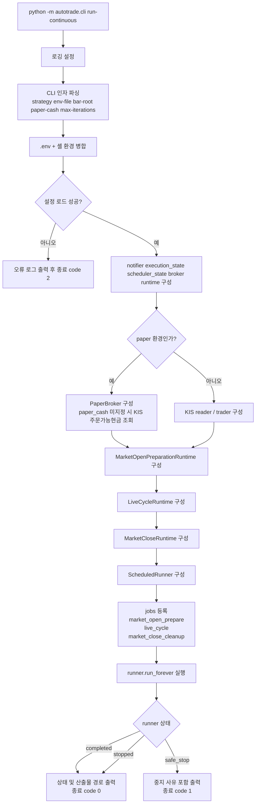
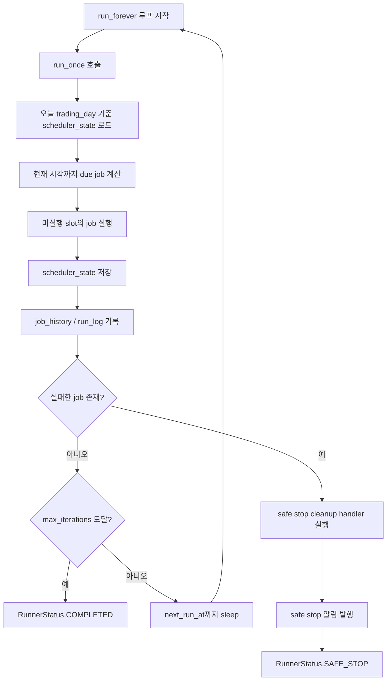
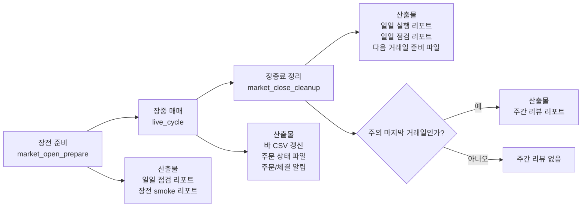
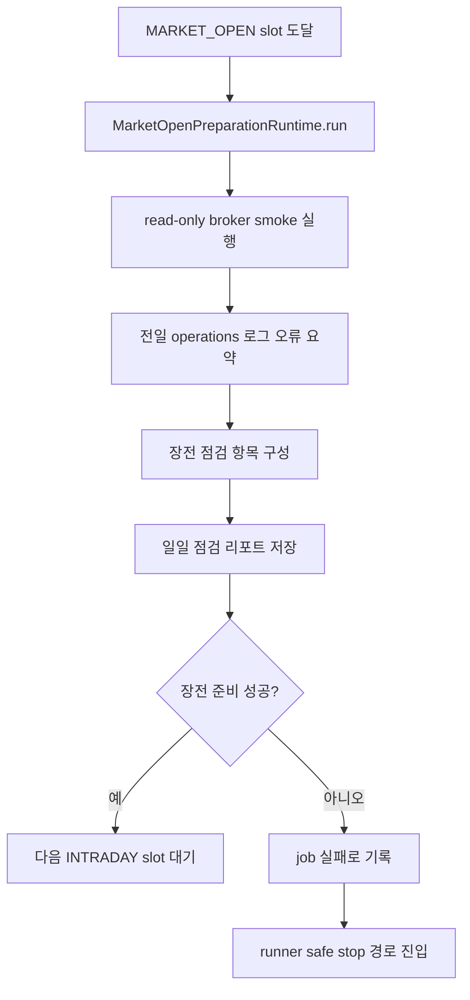
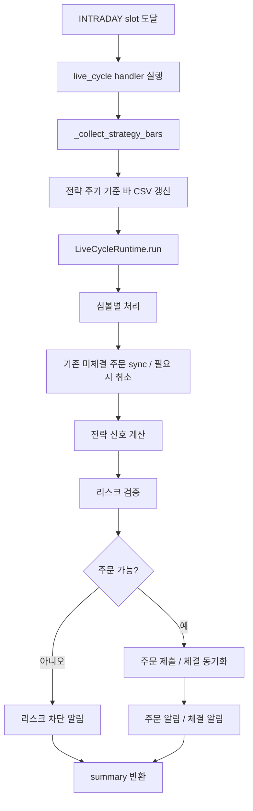
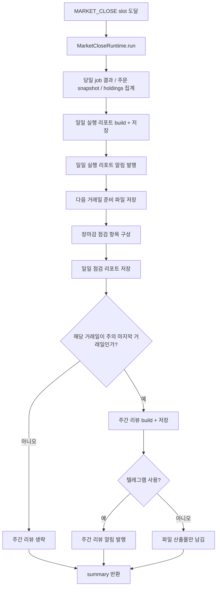
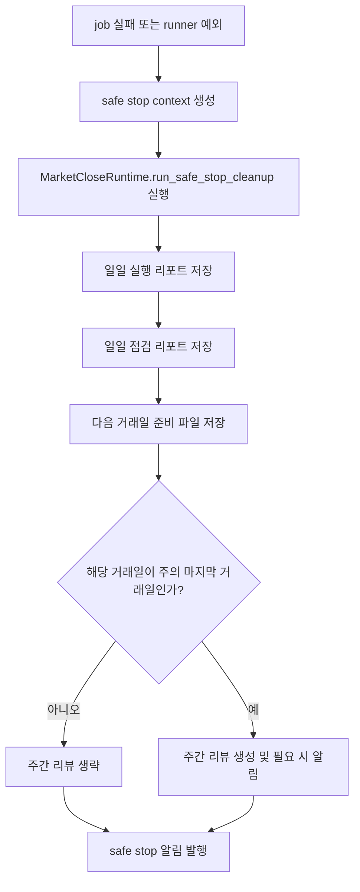

# `cli run-continuous` Flow

이 문서는 `python -m autotrade.cli run-continuous` 실행 흐름을 Mermaid로 정리합니다.

## 1. 상위 실행 흐름

## 2. Scheduler 반복 흐름

## 3. 운영 단계와 산출물

## 4. 장전 준비 상세

## 5. 장중 매매 상세

## 6. 장종료와 일간/주간 리포트 상세

## 7. Safe Stop 후처리

