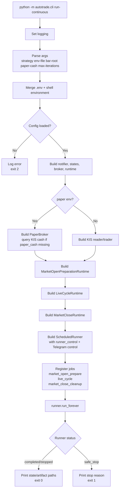
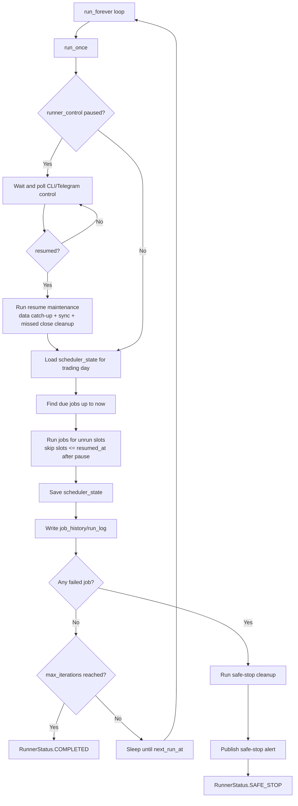
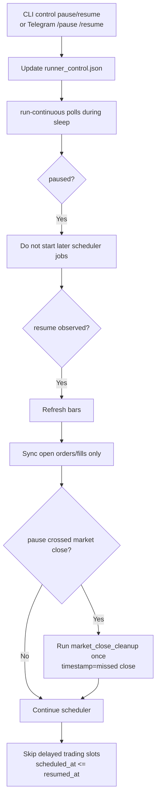
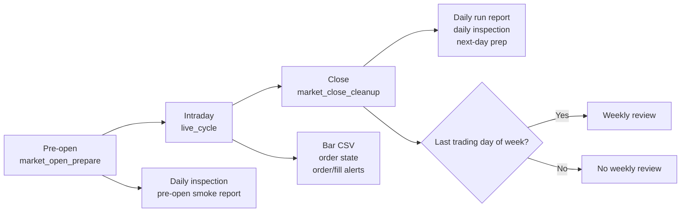
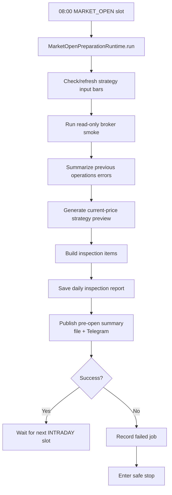
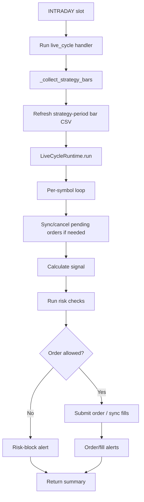
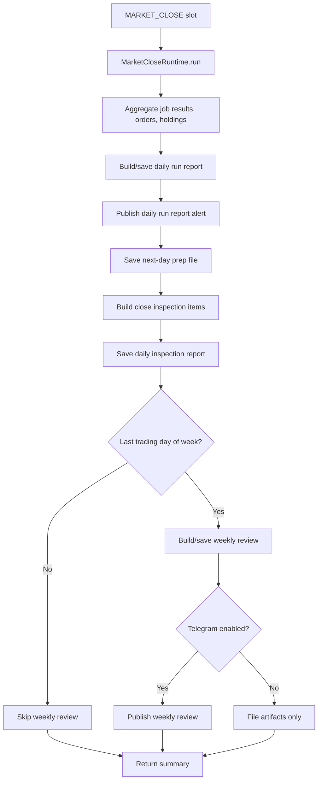
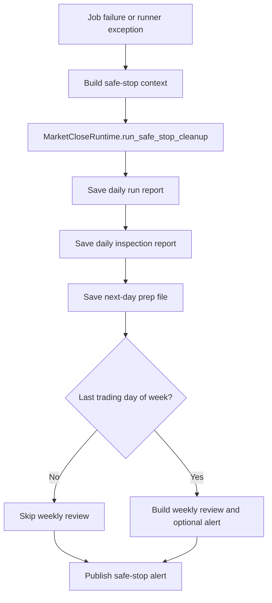

# `cli run-continuous` Flow

Mermaid overview for `python -m autotrade.cli run-continuous`.

## 1. Top-Level Flow

## 2. Scheduler Loop

## 2.1 Control Commands

## 3. Phases and Artifacts

## 4. Pre-Open Detail

## 5. Intraday Detail

## 6. Close and Reports

## 7. Safe Stop Cleanup

