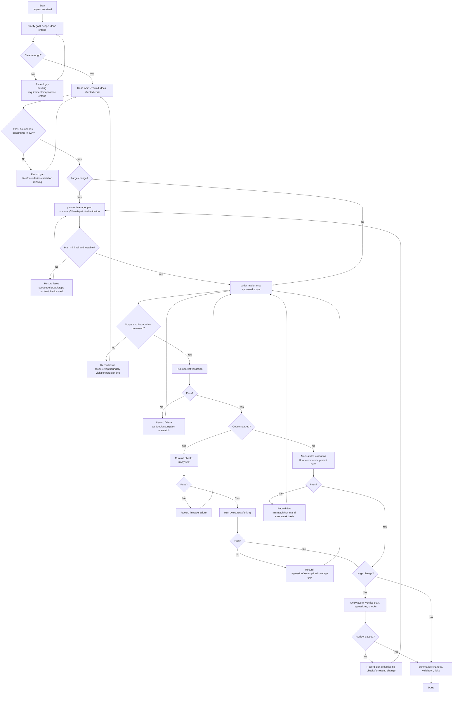

# Development Workflow

Use this flow for AutoTrade changes. Each stage has a validation gate; on failure, record the reason and return to the nearest safe stage.

## Validation Rules

- Validate the nearest relevant scope first.
- Python changes: `ruff check .` -> `mypy src/` -> `pytest tests/unit -q`.
- Docs-only changes may lack automatic checks; manually verify flow accuracy, command accuracy, and project-rule consistency, then state that in the summary.
- Record why a failure happened and which stage to revisit.

## Large-Change Gate

Use `planner/manager -> coder -> review/tester` when a change touches multiple files/modules, shared/core logic, existing behavior, or likely needs multiple implementation/validation cycles.
