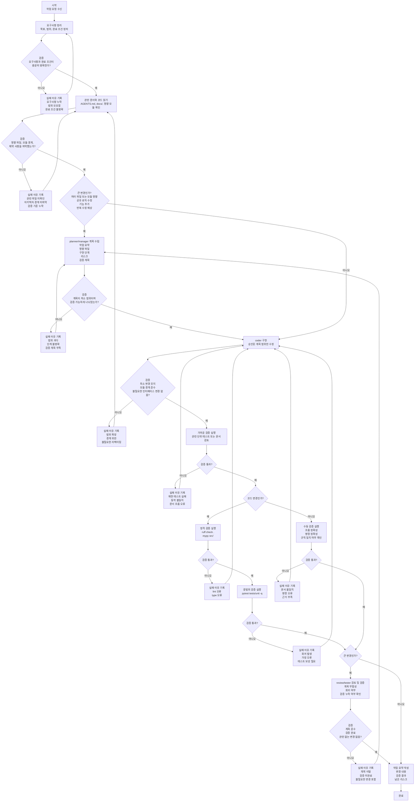

# Development Workflow

이 문서는 AutoTrade 저장소에서 변경 작업을 진행할 때 따르는 기본 개발 흐름을 정리합니다.
모든 단계는 검증 게이트를 거치며, 실패하면 실패 이유를 기록한 뒤 가장 가까운 안전한 단계로 돌아가 다시 시도합니다.

## Validation Rules

- 모든 변경은 먼저 가장 가까운 관련 범위를 검증합니다.
- Python 코드 변경은 기본적으로 `ruff check .` -> `mypy src/` -> `pytest tests/unit -q` 순서로 검증합니다.
- 문서 전용 변경은 자동 검증이 없을 수 있으므로, 흐름 정확성, 명령 정확성, 프로젝트 규칙 일치 여부를 수동으로 확인하고 요약에 명시합니다.
- 실패 이유는 단순히 "실패"로 남기지 않고, 어떤 가정이 틀렸는지와 어느 단계로 되돌아가야 하는지를 함께 기록합니다.

## Large-Change Gate

- 여러 파일 또는 모듈을 건드리는 변경
- 공유 또는 핵심 로직을 수정하는 변경
- 기존 동작에 영향을 줄 수 있는 기능 추가
- 여러 차례 구현과 검증 반복이 예상되는 변경

위 조건 중 하나라도 해당하면 `planner/manager -> coder -> review/tester` 순서를 반드시 사용합니다.
